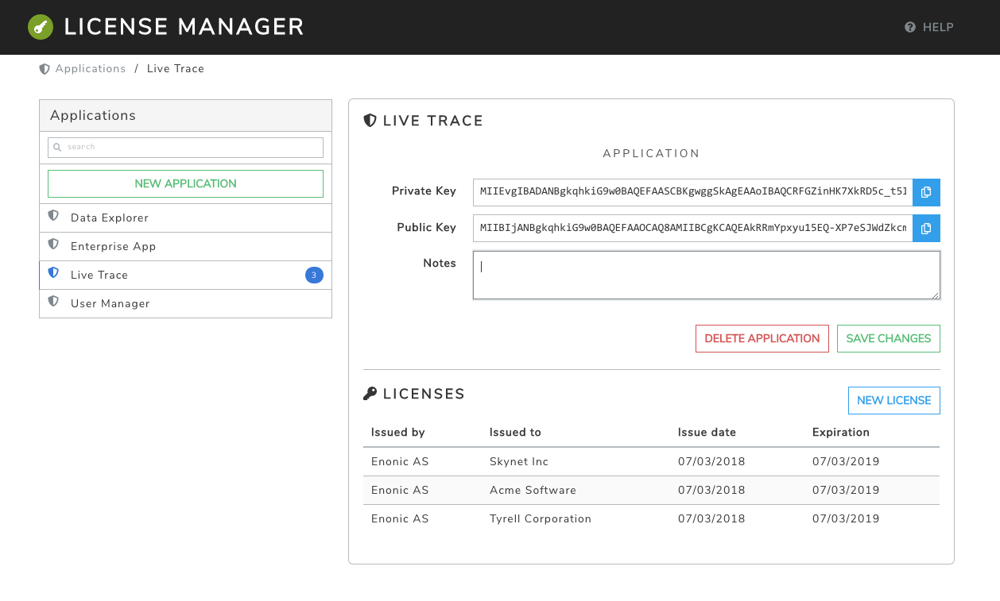

= Application Licensing

[[licensemanager]]
== License Manager

License Manager is an XP tool that can be used by application developers to control where and how their applications are able to run.

This tool works by generating a private and a public key for an application. Those keys can then be used to generate and validate licenses for specific users.



=== Add an application

To add an application click on the ``"New Application"`` button. A pop up dialog will appear with 2 fields:

* ``Name``: The application name.
* ``Notes``: A free text field to write comments about the app.

After pressing ``"Save"``, the application details will be shown. A key pair will be automatically generated for the application.
The *key pair* consists of a *private key* and a *public key* that are linked to each other.

The private key is needed for generating licenses. It should be kept in a secure location.

The public key is needed for validating licenses. It should be included in the application where it will be used. See more details below in the <<licenselibrary>> section.

NOTE: The application data is stored in a separate node repository in XP (with id ``"com.enonic.licensemanager"``).

NOTE: The license data is stored in the ``"system-repo"`` node repository.

=== Generate a license

To generate a license, select one of the applications and then click on the ``"New License"`` button.
A pop up dialog will appear with the following fields:

* ``Issued by``: The organization or entity that issues this license.
* ``Issued to``: The organization or entity this license is issued to.
* ``Issue Date``: Date from which the license will be valid.
* ``Expiration Date``: Date from which the license will no longer be valid.

Click on ``"Create License"`` and a license with the given details will be generated. The license will be stored and will be listed under the application details.

Click on the license to view its properties. In the details view there is a ``"Download"`` button to download the license file.
This file is what should be sent to the user that requested the license.

=== Delete an application

To delete an application, select one of the applications and then click on the ``"Delete Application"`` button. Then confirm the operation.

All the licenses generated for the application will also be deleted.

=== Delete a license

To delete a license, select the application the license belongs to, and then click on the license. Click on the ``"Delete"`` button to confirm the operation.

Note that deleting a license that has already been sent to the user will not invalidate it. This is because the validation key for that license is already in the user's computer.
The only thing that could be done to invalidate an installed license is to generate a new key pair for the next release version of the app.


[[licenselibrary]]
== License Library

This library contains functions to generate and validate licenses. License validation is based on public key cryptography.

To start using this library, add the following into your `build.gradle` file:

[source,groovy]
----
dependencies {
  include 'com.enonic.lib:lib-license:2.0.0'
}
----

=== Usage

The following steps show a typical example of using the license library in an app:

1. The application developer generates a key pair: a private and a public key.
2. The developer adds the public key to the application, as a resource file.
3. A user requests a license. The dev generates a license using the private key.
4. The user receives the license file and uploads it to the app.
5. The app validates the license, using the public key, and installs it in the XP repo.
6. After that the app can check the installed license and implement some logic depending on it.

Steps 1 and 3 can be done using the <<licensemanager>> app. Although it is also possible to implement it using the functions in this library.

To use this library in your JavaScript code, it first needs to be required:

[source,js]
----
var licenseLib = require('/lib/license');
----

=== Generate a key pair

License generation in this library is based on public key cryptography. We start by generating a *key pair*, which is a *private key* and a *public key* that are linked to each other.
The private key is used to generate new licenses. And those new licenses can only be validated using the public key.
Only one key pair per application is needed.

[source,js]
----
var keyPair = licenseLib.generateKeyPair(); <1>
var privateKey = keyPair.privatekey;        <2>
var publicKey = keyPair.publicKey;          <3>
----
<1> Generate a new keyPair for each application that will requires licenses to be used.
<2> The private key should be kept in a secure place.
<3> The public key should be included in the application.

=== Generate a license

Every customer installation using the application will need a new license.

License generation is done outside of the application that will use it.

To generate a new license call the ``generateLicense`` function, using the private key generated in the previous step.

[source,js]
----
var license = licenseLib.generateLicense(privateKey, {
    issuedBy: 'Enonic',                       <1>
    issuedTo: 'Acme Corporation',             <2>
    issueTime: '2017-10-01T09:11:00Z',        <3>
    expiryTime: new Date(2018, 9, 1, 9,11,0), <4>
    properties: {
        'widgets': 42                         <5>
    }
});
----
<1> The organization or entity that issues the license.
<2> The organization or entity this license is issued to.
<3> Issue date and time, in string format in this example.
<4> Expiration date and time, using a Date object in this example.
<5> Other optional custom properties.


=== Validate a license

To validate a license from the application call the ``validateLicense`` function.

This function uses the public key to validate and decode the license string.
The public key can be passed explicitly or it can be included as a file in the application instead.
In the latter case the public key file should be placed in ```'src/main/resources/app.pub'```.

[source,js]
----
var licenseDetails = licenseLib.validateLicense({
    license: license,
    appKey: 'com.enonic.myapp'
});

var isValid = licenseDetails && !licenseDetails.expired;
if (!isValid) {
    showErrorMessage();
    return;
}

var issuedTo = licenseDetails.issuedTo;
var widgets = licenseDetails.properties.widgets;
----

IMPORTANT: It is very important that only the public key is included in the application. The private key must never be accessible, except for the issuer of licenses.


=== Installing a license

Once a license has been validated by the app, it can be installed in the XP repo.

[source,js]
----
licenseLib.installLicense({
    license: licenseStr,
    appKey: 'com.enonic.myapp'
});
----

After the license has been installed, it can be validated by just passing the ```appKey``` parameter.

[source,js]
----
licenseLib.installLicense({appKey: 'com.enonic.myapp'});
----

== API

The following functions are defined in this library.

=== `generateKeyPair`

Generates a public/private key pair to be used for license generation and validation.

*Returns*

The function will return a new key-pair object with the following properties:

* `*privateKey*` (_string_) Base64 encoded string of the private key.
* `*publicKey*` (_string_) Base64 encoded string of the public key.

=== `generateLicense`

Generates a license based on a private key and license details.

*Parameters*

* `privateKey` (_string_) Private key string.
* `license` (_object_) Object with the license details.
** `*issuedBy*` (_string_) The entity that issued this license.
** `*issuedTo*` (_string_) The entity this license is issued to.
** `*issueTime*` (_string_ | _Date_) Time when the license was issued.
** `*expiryTime*` (_string_ | _Date_) Expiration time for the license.
** `*properties*` (_object_) Custom key-value properties. Optional

*Returns*

The function will return the license string.

=== `validateLicense`

Validates a license using the public key, and returns the license details if successful.

*Parameters*

* `options` (_object_) Object with the parameters to validate a license.
** `*license*` (_string_) Encoded license string. Optional.
** `*publicKey*` (_string_) Public key. Optional.
** `*appKey*` (_string_) Application key. Optional.

*Returns*

The function will return the license details object, or null if the license is not valid.

All the parameters are optional. When called without parameters:

* it will look for the license file in 'XP_HOME/license/<appKey>.lic'. Otherwise it will check if it is installed in the repository (see `installLicense` function).
* it will look for the publicKey as a file with path "src/main/resources/app.pub" in the current app.
* it will use the current application's key.

TIP: The ``appKey`` parameter does not necessarily need to be the same as the application key.
It is possible for a group of apps to use the same license, they just need to pass the same appKey when calling the validateLicense function.

=== `installLicense`

Validates and stores a license in the XP node repo.

*Parameters*

* `options` (_object_) Object with the parameters to install a license.
** `*license*` (_string_) Encoded license string.
** `*publicKey*` (_string_) Public key to validate the license. Optional, if not set it will look for it in the current app.
** `*appKey*` (_string_) Application key.

*Returns*

The function will return ``true`` if the license was successfully installed, ``false`` otherwise.

=== `uninstallLicense`

Removes an installed license from the XP repo.

*Parameters*

* `*appKey*` (_string_) Application key.
